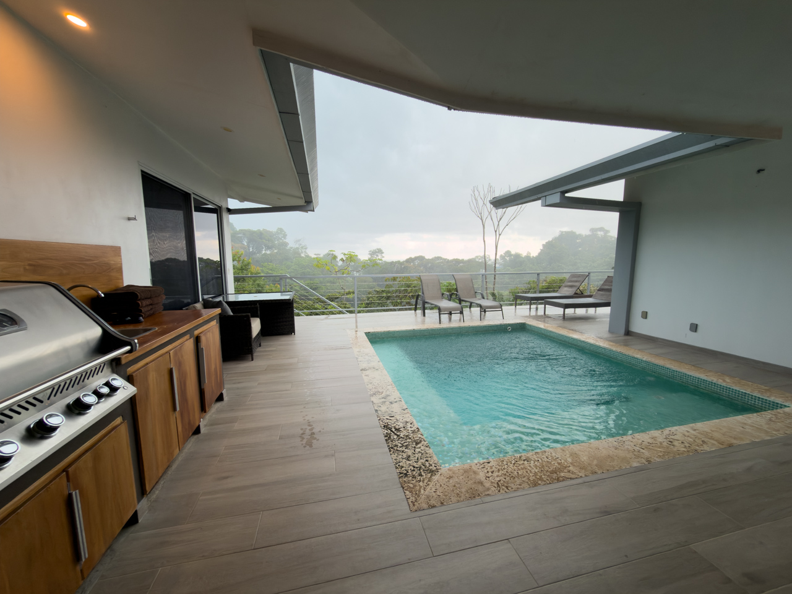

Nous reprenons la route pour n'arriver pas trop tard au logement suivant, une magnifique villa sur les hauteurs, avec piscine privée sur la terrasse, et une quasi-vue sur l'océan. Ce sera l'étape un peu luxe du séjour, pour 2 nuits un peu plus confortables.

{.center}

La bonne surprise était la présence d'un sèche linge, permettant de faire un peu de lessive à la main et d'avoir de nouveau des vêtements et sous-vêtemens propres et sec. C'est ça le vrai luxe !
