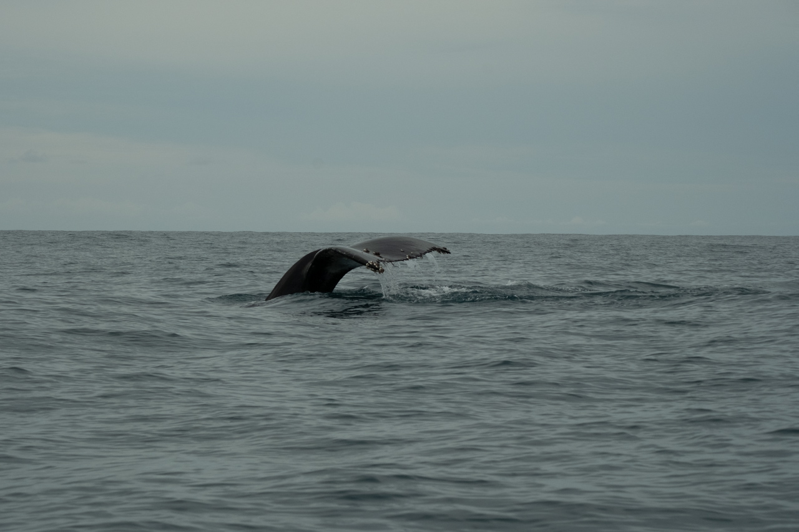
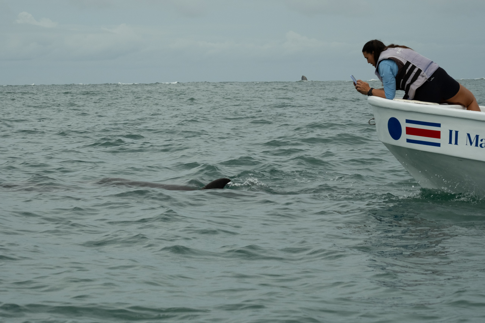
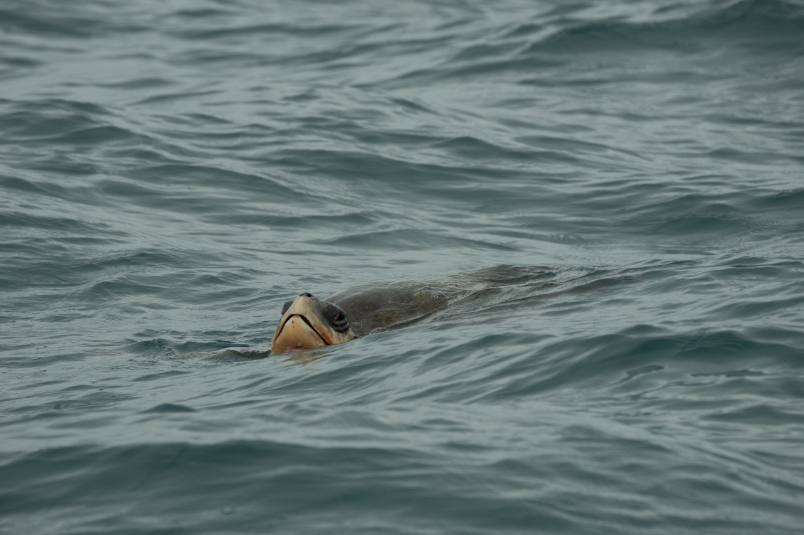
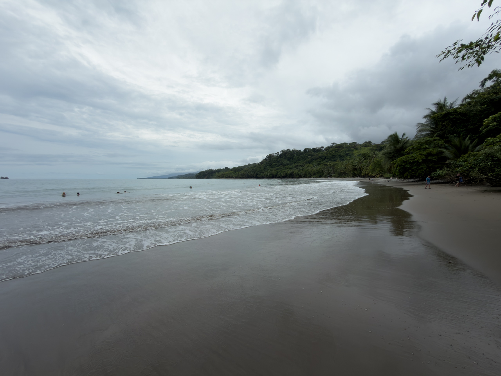
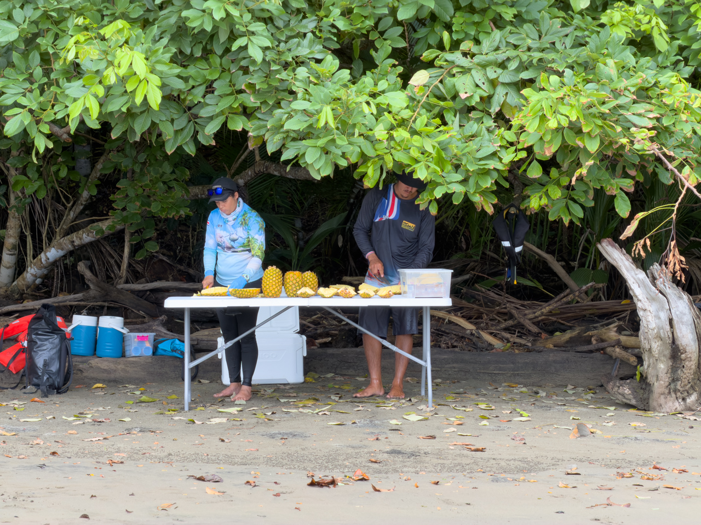

Embarquement à côté de la célèbre plage en forme de queue de baleine d’Uvita pour un tour en bateau pour observer les dauphins et les baleines à bosse.

Les baleines viennent ici en cette saison pour donner naissance aux baleineaux, dans des eaux plus chaudes qu’au large du Chili, où elles se trouvent le reste de l’année.

Nous n’avons vu qu’un mâle, qui passe jusqu’à 45 minutes sous l’eau entre respiration en surface (les baleineaux et leurs mères font surface en gros toutes les 5 minutes). Autant dire qu’on n’a pas vu grand chose, c’est le principe de l’observation en milieu naturel.

{.center}

Nous avons aussi vu deux groupes de dauphins d’espèces différentes, qui naviguent volontiers à côté des bateaux.

{.center}

Ainsi qu'une tortue :

{.center}

Et nous avons pu profiter d’ananas fraîchement coupés lors d’une pause sur la Playa Piñuelas.

{.center}

{.center}

Une belle sortie, malgré le peu d’animaux vus.
