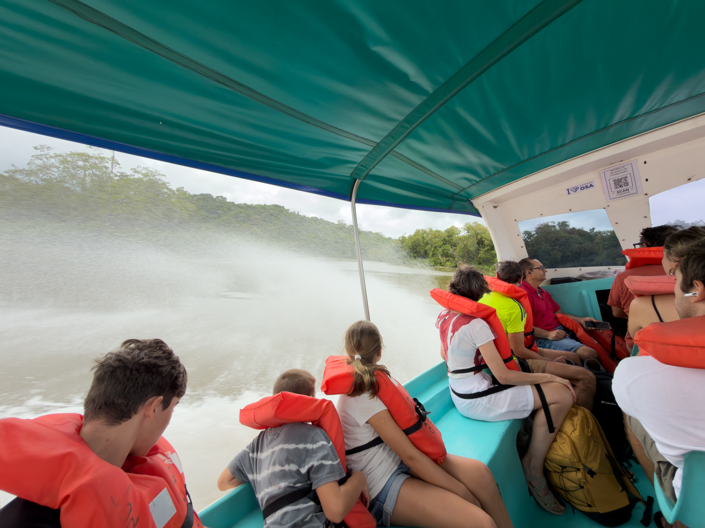
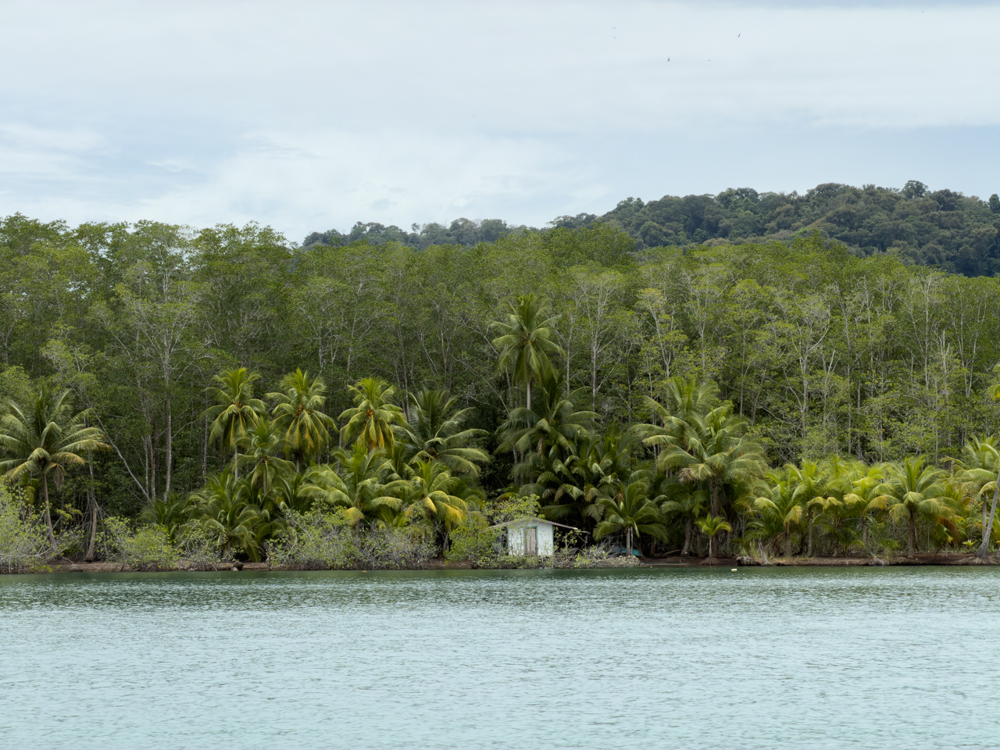
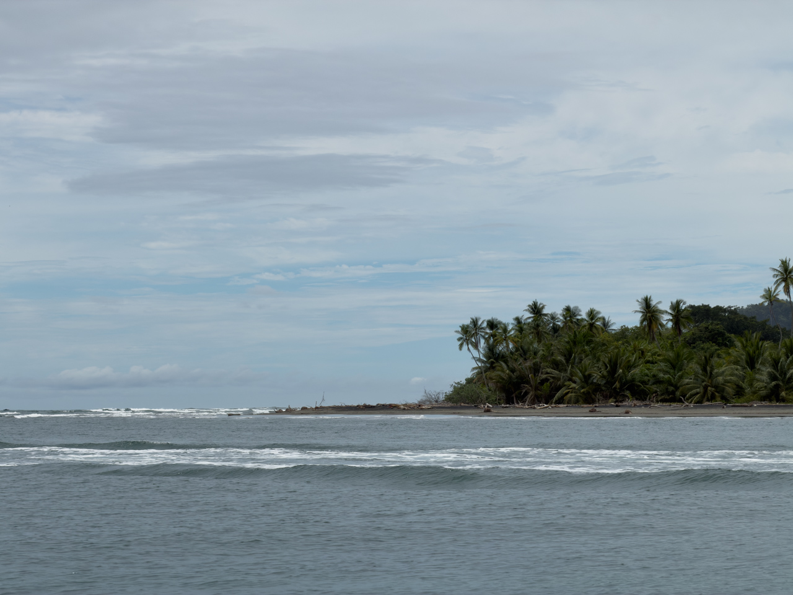
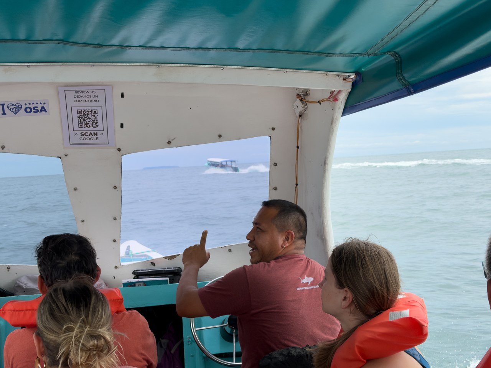
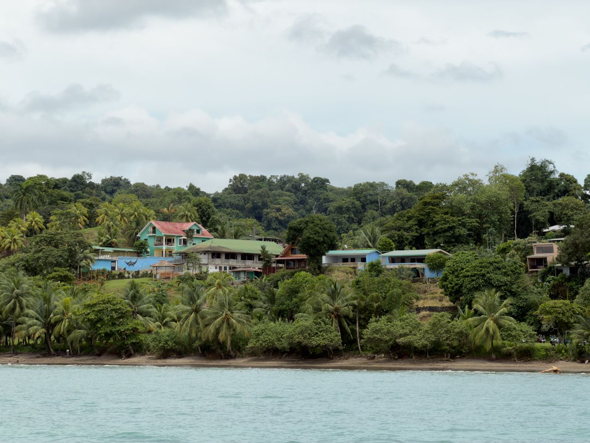

Aucune trace du trajet en voiture jusqu'à Sierpe, où nous prenons le bateau pour rejoindre notre nouvelle étape, le logement Poor Man's Paradise sur la côte Pacifique, dans la commune de Drake.

Le bateau est généralement préféré à la voiture pour ce trajet, aucune route digne de ce nom n'étant vraiment présente.

{.center}

{.center}

Après avoir descendu la rivière Sierpe, nous rejoignons le Pacifique, pour une fin de parcours un peu plus mouvementée.

{.center}

{.center}

{.center}
