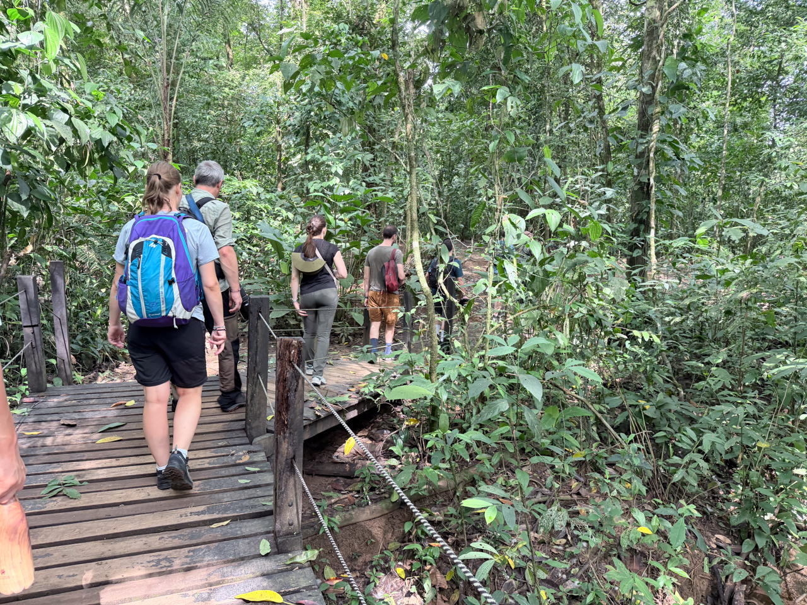
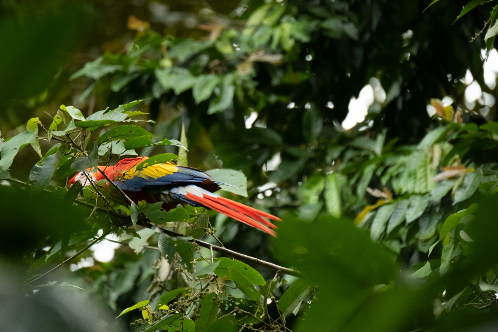
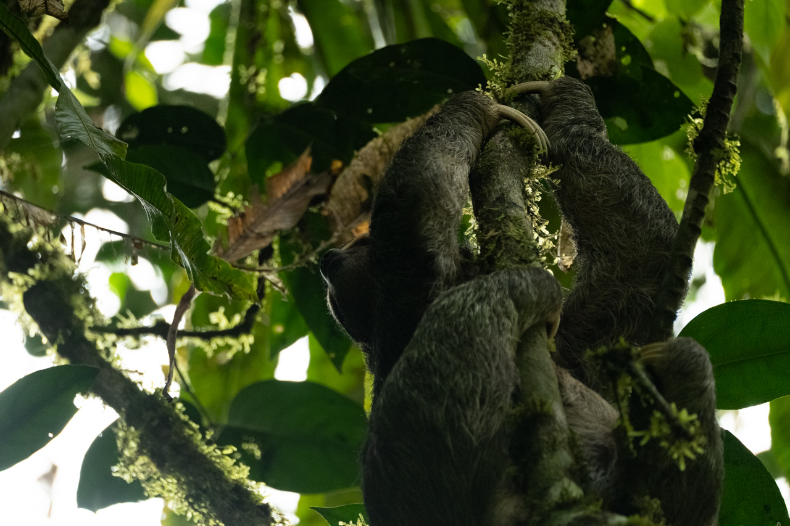
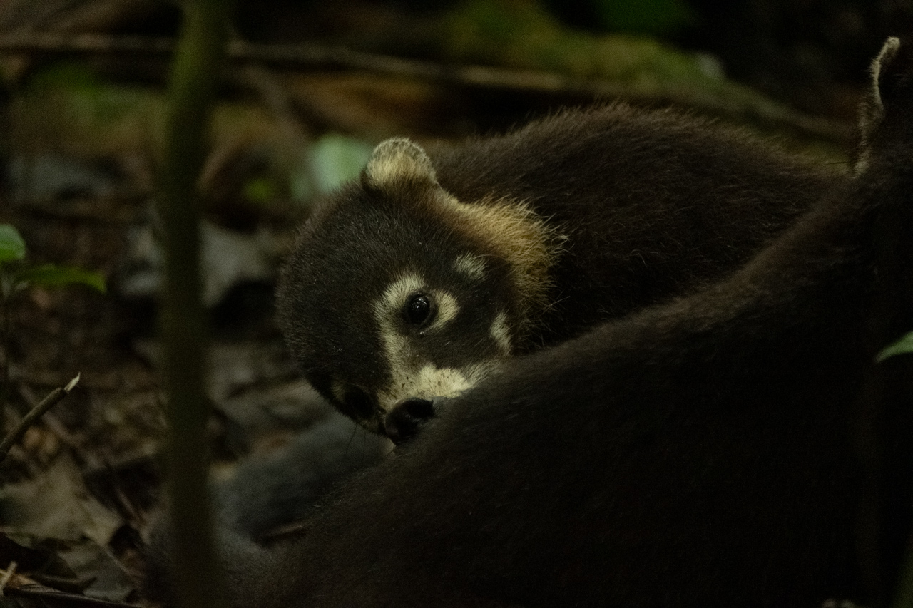
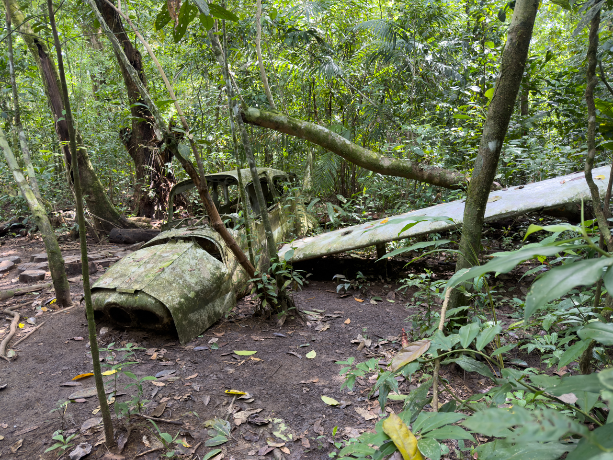
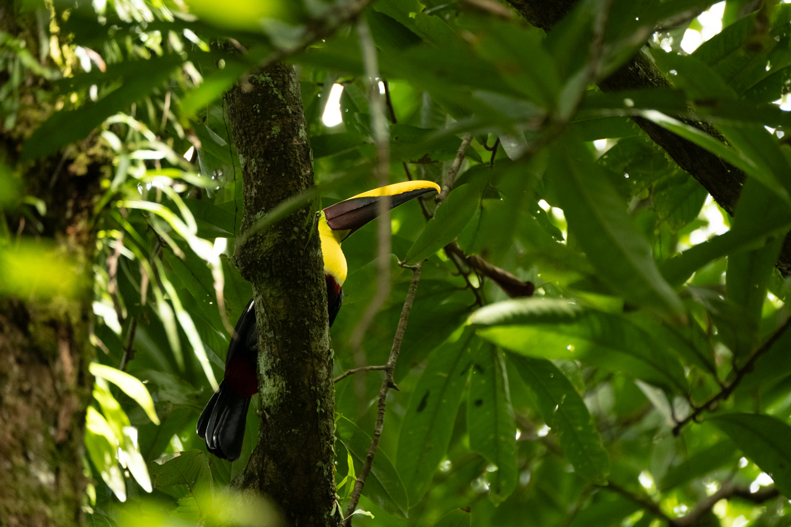
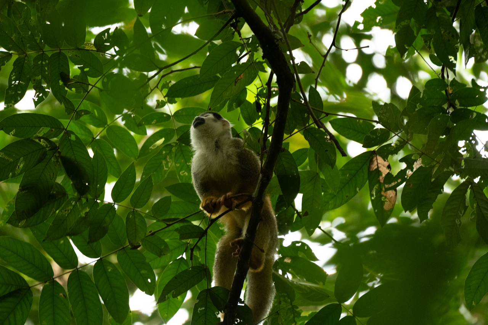
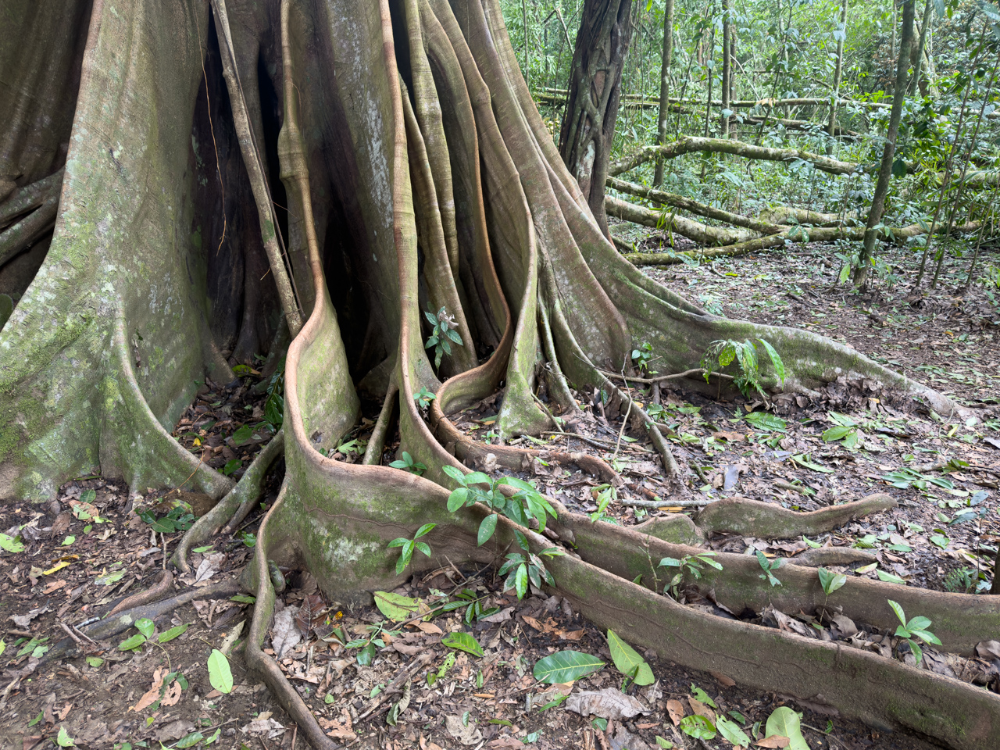
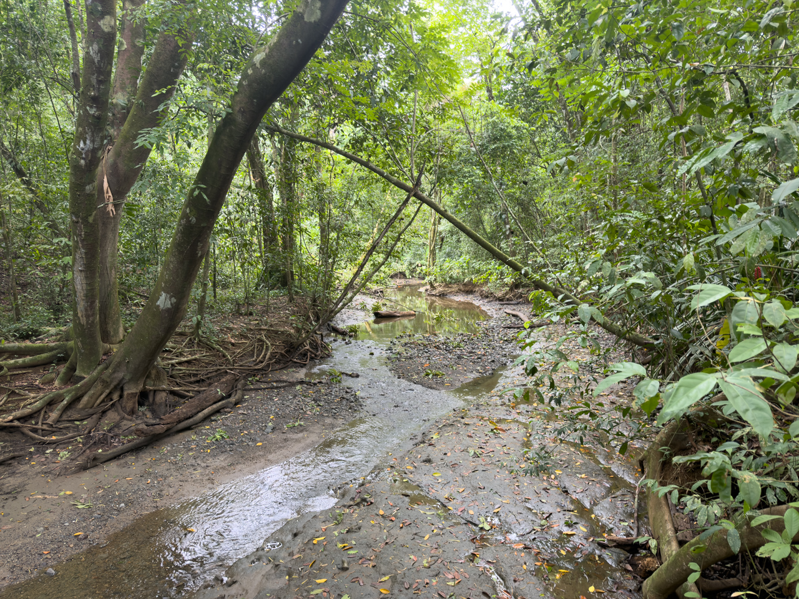
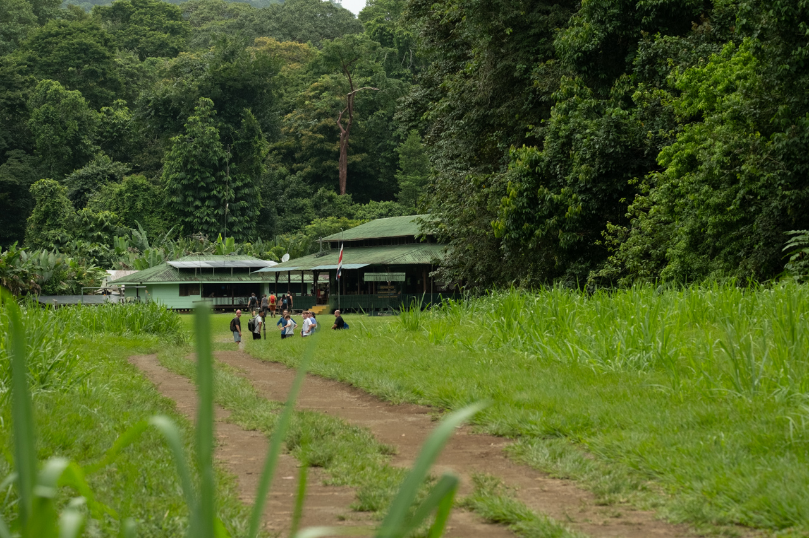

Une dernière excursion dans un parc naturel de protection de l’écosystème naturel du Costa Rica.

{.center}

Il y a 50 ans, il y avait là des exploitations agricoles, et maintenant une forêt secondaire s’est reformée toute seule, et la faune est diverse et nombreuse. La nature est formidable.

{.center}

{.center}

{.center}

{.center}

{.center}

{.center}

{.center}

{.center}

En bonus, déjeuner tout à fait traditionnel à la station Sirena où résident et travaillent les gardes du parc et des scientifiques qui en observent la vie et les habitants.

{.center}

