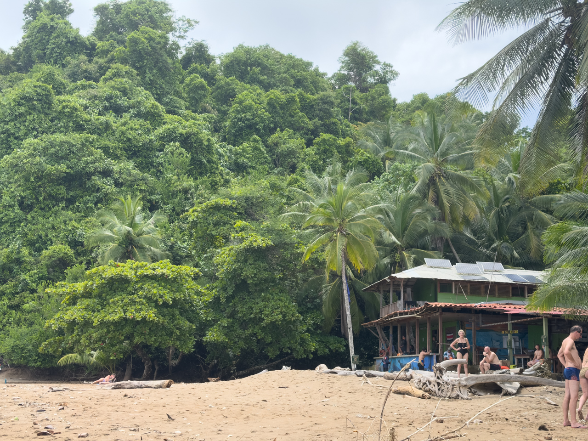
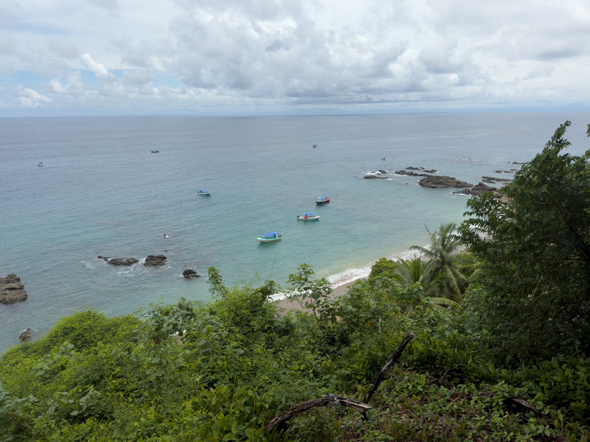

Après notre première séance de snorkeling, pause sur une plage pour se reposer un peu et profiter du paysage.

{.center}

{.center}

Isla del Caño ne fait heureusement pas partie des [Cinq Morts](https://jurassicpark.fandom.com/fr/wiki/Les_Cinq_Morts), bien qu'elle ne soit pas très éloignée de [Isla Nublar](https://jurassicpark.fandom.com/fr/wiki/Isla_Nublar). Aucun [dinosaure vindicatif](https://jurassicpark.fandom.com/fr/wiki/Jurassic_Park_(parc)) en vue, ouf !

