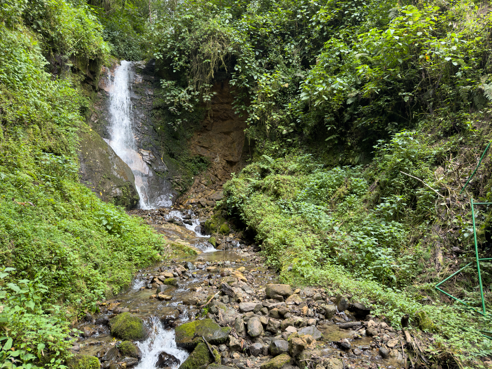
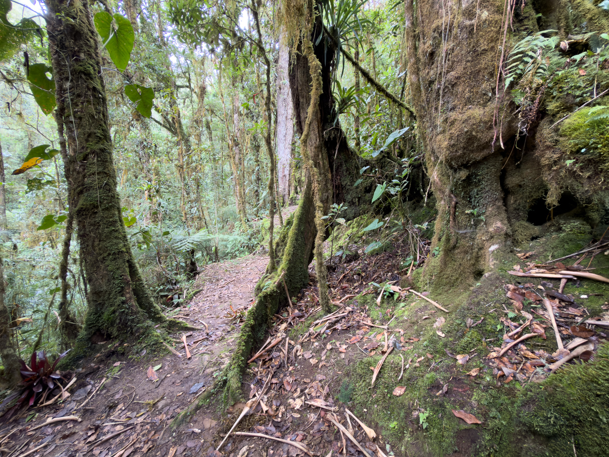
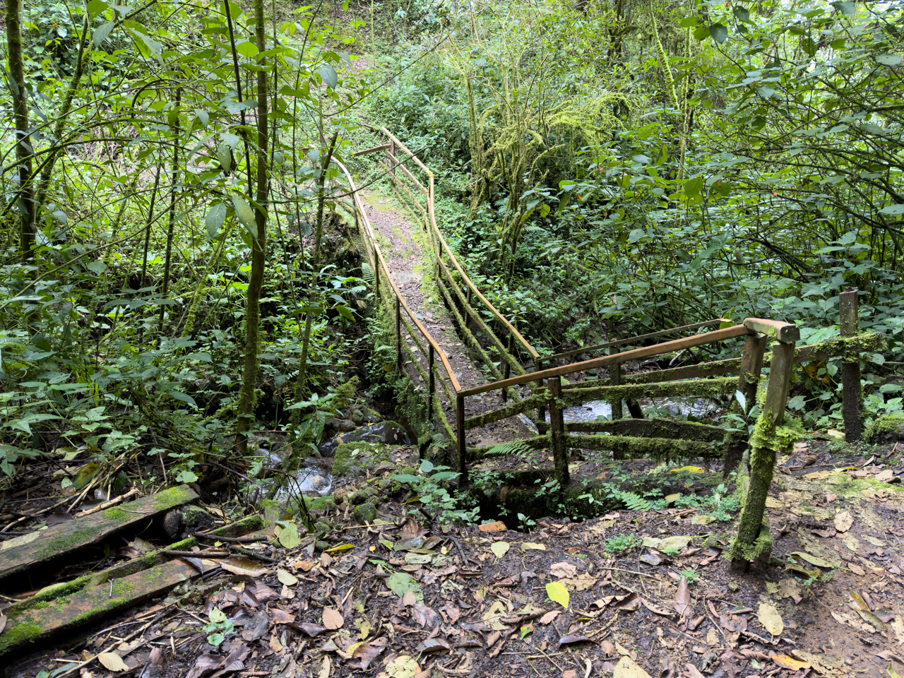
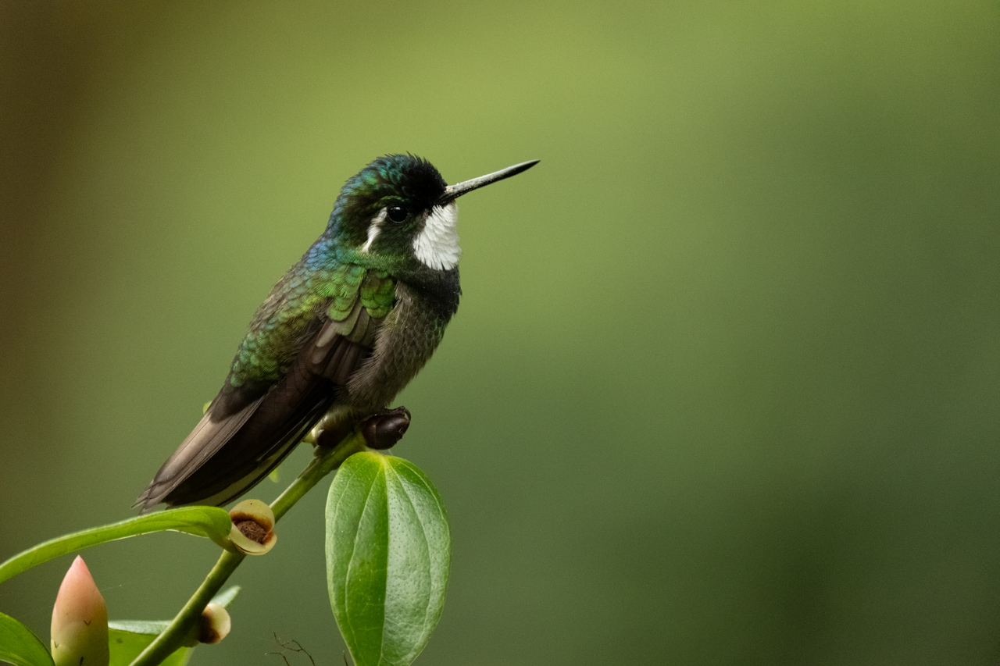
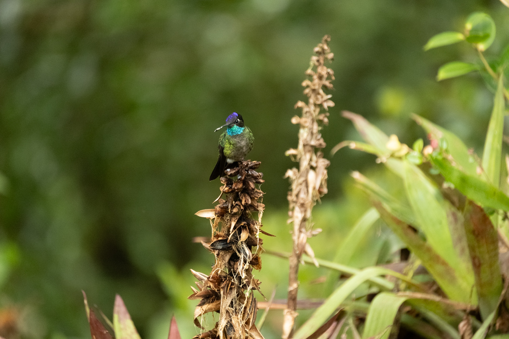
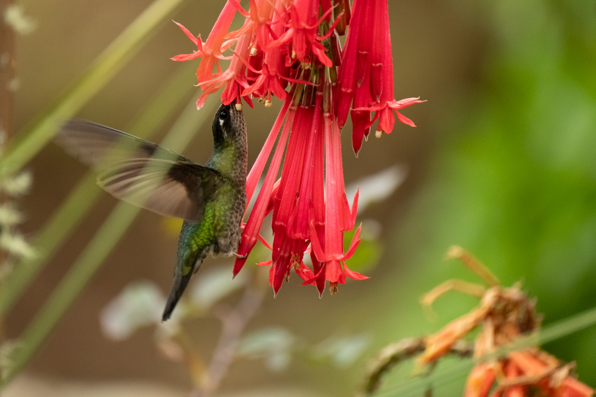
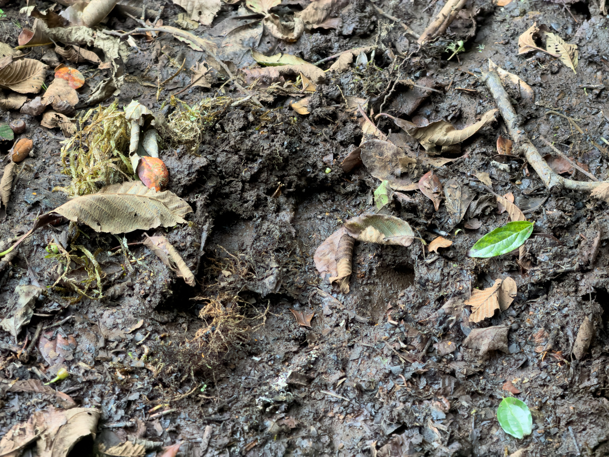

Petit trail sur un bout de forêt appartenant à notre lieu de résidence pour la nuit, à San Gerardo de Dota.

{.center}

{.center}

{.center}

L’endroit est normalement parfait pour observer le fabuleux Quetzal, mais nous n’en avons vu aucun.

De nombreux colibris étaient là par contre. 🤩

{.center}

{.center}

{.center}

Et pas mal de traces de tapir (empreintes et excréments), animal que nous n’avons malheureusement pas vu durant le séjour.

{.center}
