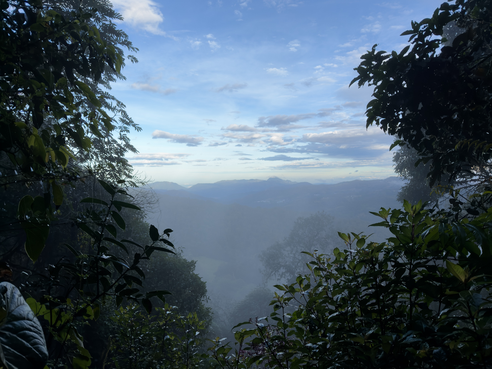
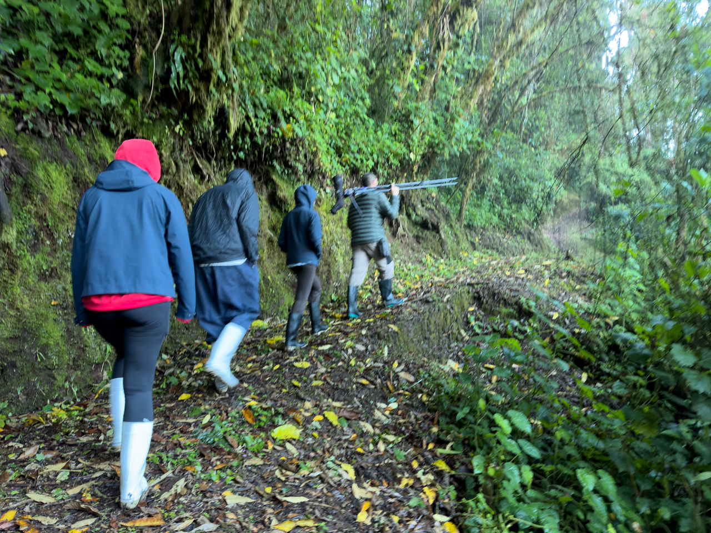
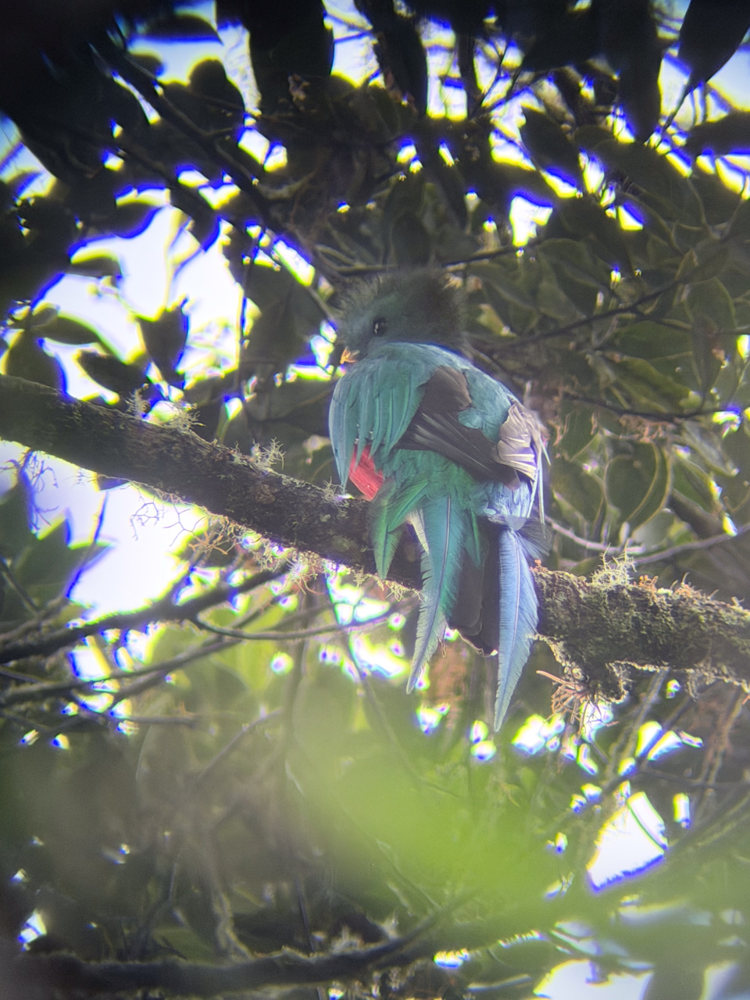

Nous avons beau être dans le Parque Nacional Los Quetzales, cet oiseau mythique reste très difficile à trouver.

Après un départ à 6h du matin, et 2h de trail dans la forêt avec un guide spécialisé, nous avons failli rentrer bredouilles.

{.center}

{.center}

Heureusement, au tout dernier moment, les sifflements du guide ont trouvé une réponse dans les immenses arbres touffus, et nous avons enfin eu le privilège d’observer quelques instants ce merveilleux oiseau. 😍

{.center}
