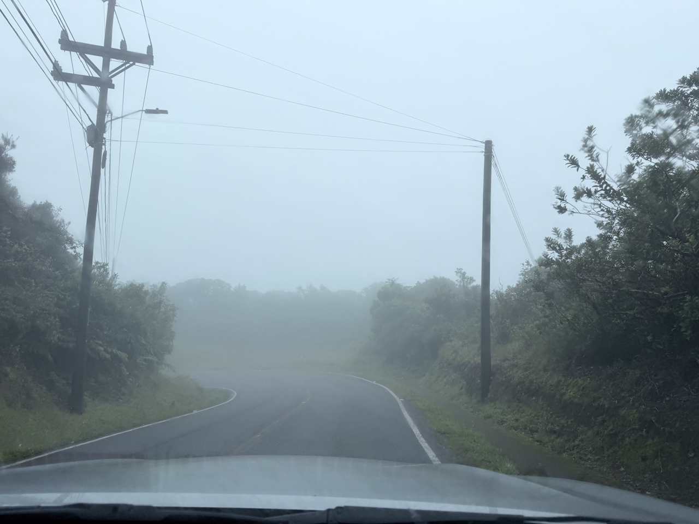
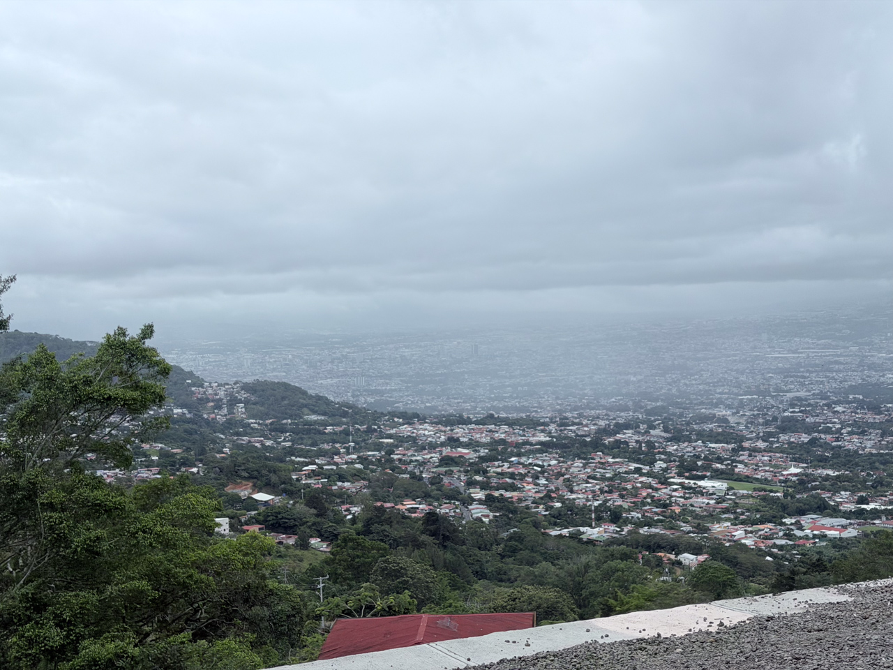
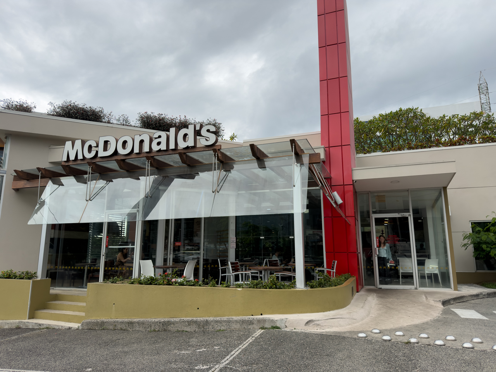

Retour à San José et son aéroport en évitant les grands axes, en restant au maximum sur les crêtes et à flanc de montagne, dans de superbes paysages.

{.center}

{.center}

Et petite étape au McDonald's local pour voir si les menus sont différents. 😅

{.center}

Snif, c'est déjà fini. 😔

Mais on a bien profité de nos 17 jours au Costa Rica ! ❤️❤️❤️
