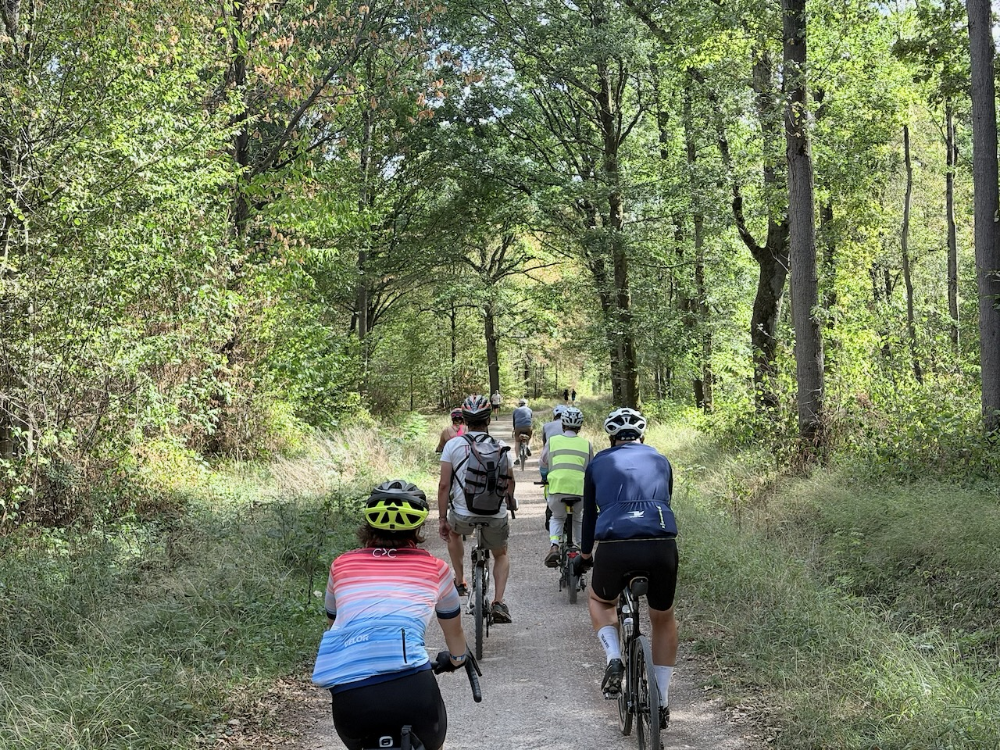
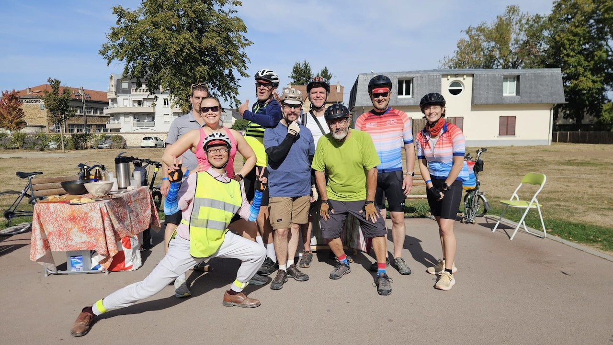

Tout comme [la C4C de Villeubanne](../../06/cyclo-pour-le-climat-c4c-de-villeurbanne/) avait été repoussée de fin mai au 6 septembre à cause de la canicule, la C4C de Paris a été repoussée de fin juin à ce 19 septembre.

Là encore, c'est un succès avec près de 107 km au compteur (il en manque les 200 derniers mètres, ma montre s'étant éteinte… 😔), sur une belle trace avec une partie gravel en forêt pour éviter une départementale trop désagréable voire dangereuse.

{.center}

Et une étape à mi-parcours calée sur une excellente boulangerie, avec un super flan à la vanille. 🤩

{.center}

Tout ça avec une équipe très sympa, motivée, et chacun·e prêt·e à aider les autres. 🥰

{.center}

Comme pour mes 100 km précédents (déjà 4 en 2 mois ! 😲), j'ai eu un coup de mou entre 70 et 80 km, mais c'est ensuite reparti pour le finish, agréable en bord de marne.

Un grand bravo à l'équipe d'organisation, dont Emeline, pour la réussite de ce bel événement, et merci à tous les bénévoles qui ont aidé pour la logistique au départ, aux ravitaillements, et à l'arrivée.

Je referai certainement une ou plusieurs C4C l'an prochain, on y prend goût !
